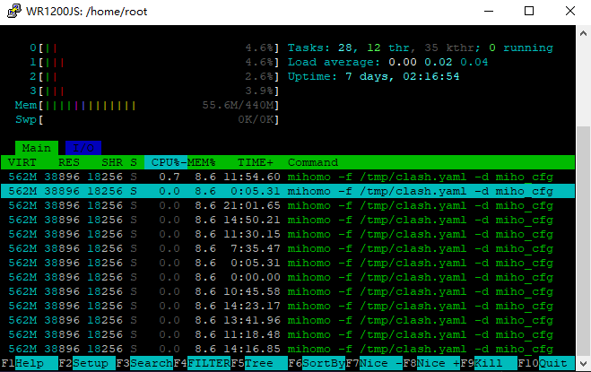
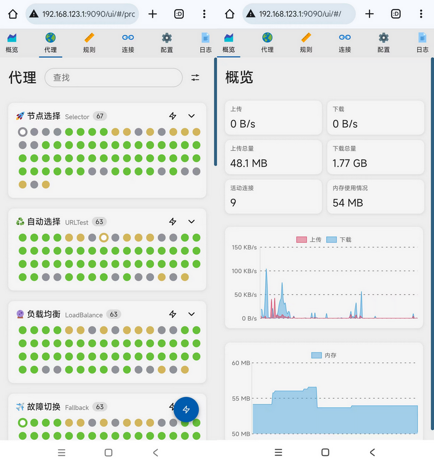

# sub2mihomo
- mihomo(clash)订阅转换脚本(c.sh)，支持将各种节点订阅转换成mihono的配置文件。
- 支持解析各种订阅链接，支持解析ss/ssr/vmess/trojan/vless/hysteria/hysteria2节点，并且可以融合多个订阅链接的节点数据。
- 脚本解析出节点信息后，将节点插入到yaml模板文件中以生成配置文件，然后启动mihomo。
- 本脚本在padavan(hiboy)和armbian(bullseye)环境下测试运行OK。

## 依赖程序
- [yq(>=v4.x)](https://github.com/mikefarah/yq)
- [jq](https://github.com/jqlang/jq)
- [mihomo](https://github.com/MetaCubeX/mihomo)
- curl

## 使用说明
- 下载好上面的依赖程序，yq和jq需要放在环境变量PATH的目录中，在终端运行yq --version和jq --version确保正常执行。
- 下载本仓库的c.sh和ts.yaml
- 修改c.sh的参数，变量说明如下：

| 变量   |   说明 |
|  :--  | :-- |
| SUBLINK | 订阅链接，多个链接要以换行或空格隔开 |
| TEMPLATE | YAML配置文件的模板 |
| CFGFILE | 最终生成的YAML配置文件 |
| CFGDIR | mihomo的配置文件目录，（mihomo默认的配置目录是~/.config/mihomo/） |
| BIN | mihomo的路径，如果放在PATH的目录下，可以直接用mihomo的名称 |
| LOCKFILE | flock的锁文件，不需要修改 |

- 按照自己的喜好修改ts.yaml的配置。
- 从[这里](https://github.com/MetaCubeX/Yacd-meta/blob/master/README_CN.md)下载UI文件gh-pages.zip并解压到CFGDIR目录下
- 执行./c.sh





## 注意
- 第一次运行脚本，mohomo程序会下载一些数据到CFGDIR中，脚本看不到执行的结果，推荐运行完成脚本后执行下面的命令，手动启动mihomo来观察执行情况。
```
BIN=xxx
CFGFILE=xxx.yaml
CFGDIR=/xxx/yyy
killall "${BIN##*/}"
$BIN -f "$CFGFILE" -d "$CFGDIR"
```
- 脚本执行时间可能比较长，特别是节点数目较多时。
- 如果节点的名称存在重复，脚本会去重处理，而不是重命名。
- 节点解析的逻辑没有完整的验证过，可能存在BUG。

## 参考
- [SubConv](https://github.com/SubConv/SubConv)
- [ssr-decode](https://github.com/xlucn/ssr-decode)
